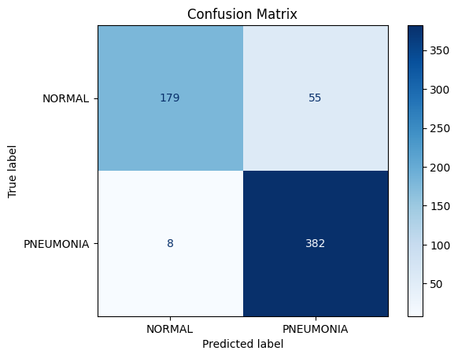
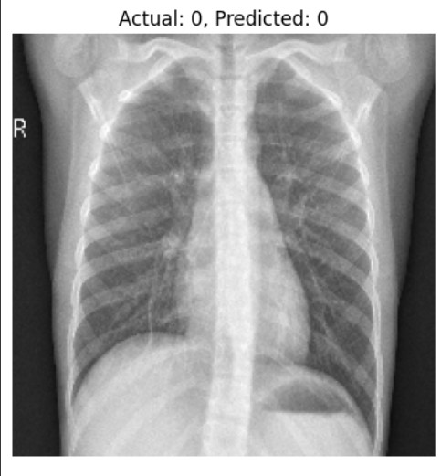
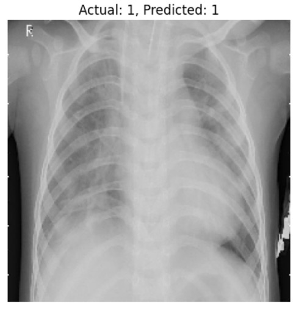

# Pneumonia Detection from Chest X-Rays

This personal project is a deep learning-based system for detecting pneumonia from chest X-ray images using a convolutional neural network (CNN) built on the VGG16 architecture. It includes a trained model, a prediction script, and sample images to test the model.

---

## Table of Contents

- [Project Overview](#project-overview)
- [Model Details](#model-details)
- [Model Performance](#model-performance)
- [Folder Structure](#folder-structure)
- [Requirements](#requirements)

---

## Project Overview

Pneumonia is a serious lung infection that can be detected from chest X-ray images. This project uses **transfer learning** with a pre-trained VGG16 network to classify X-ray images into:

- **NORMAL**
- **PNEUMONIA**

The system preprocesses images, feeds them into the model, and outputs a predicted class with confidence.

---
## Model Details

Architecture: VGG16 (pre-trained on ImageNet) + custom fully connected layers  
Input Size: 224x224 RGB images  
Output: Binary classification (0 = NORMAL, 1 = PNEUMONIA)  
Files:  
pneumoniaDetectionModel.keras — Keras 3 native format (recommended)  
pneumoniaDetectionModel.h5 — legacy HDF5 format  
pneumoniaDetectionModel_SavedModel/ — TensorFlow SavedModel format  

---

## Model Performance

- **Test Accuracy:** 90%
- **Test Loss:** 0.31

### Confusion Matrix

### Classification Report

| Class       | Precision | Recall | F1-score | Support |
|-------------|-----------|--------|----------|---------|
| NORMAL      | 0.96      | 0.76   | 0.85     | 234     |
| PNEUMONIA   | 0.87      | 0.98   | 0.92     | 390     |
| **Accuracy**|           |        | 0.90     | 624     |
| Macro Avg   | 0.92      | 0.87   | 0.89     | 624     |
| Weighted Avg| 0.91      | 0.90   | 0.90     | 624     |

### Sample Predictions

_Normal X-ray predicted as NORMAL_

_Pneumonia X-ray predicted as PNEUMONIA_

---

## Folder Structure
pneumonia-detection/
│
├── models/
│ ├── pneumoniaDetectionModel.keras
│ ├── pneumoniaDetectionModel.h5
│ └── pneumoniaDetectionModel_SavedModel/
│
├── src/
│ └── predict.py
│
├── notebook/
│ └── PneumoniaDetectionML.ipynb
│
├── sample_images/
│ ├── sample-normal-1.jpg
│ ├── sample-normal-2.jpg
│ ├── sample-pneumonia-1.jpg
│ └── sample-pneumonia-2.jpg
│
├── requirements.txt
└── .gitignore

---
## Requirements

Dependencies are listed in requirements.txt:
tensorflow>=2.19.0
numpy>=2.0.2
Pillow>=11.3.0
scikit-learn>=1.6.1
matplotlib>=3.10.0
pandas>=2.2.2
