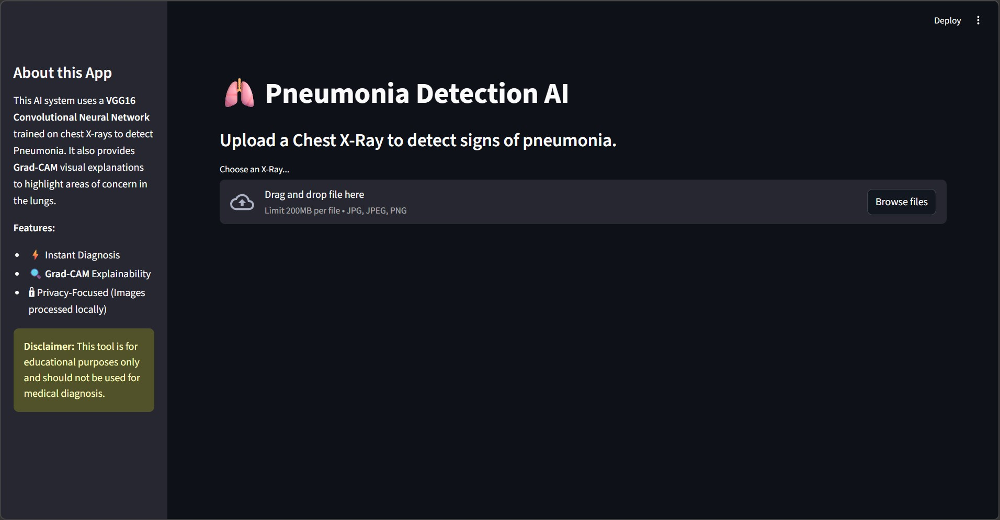
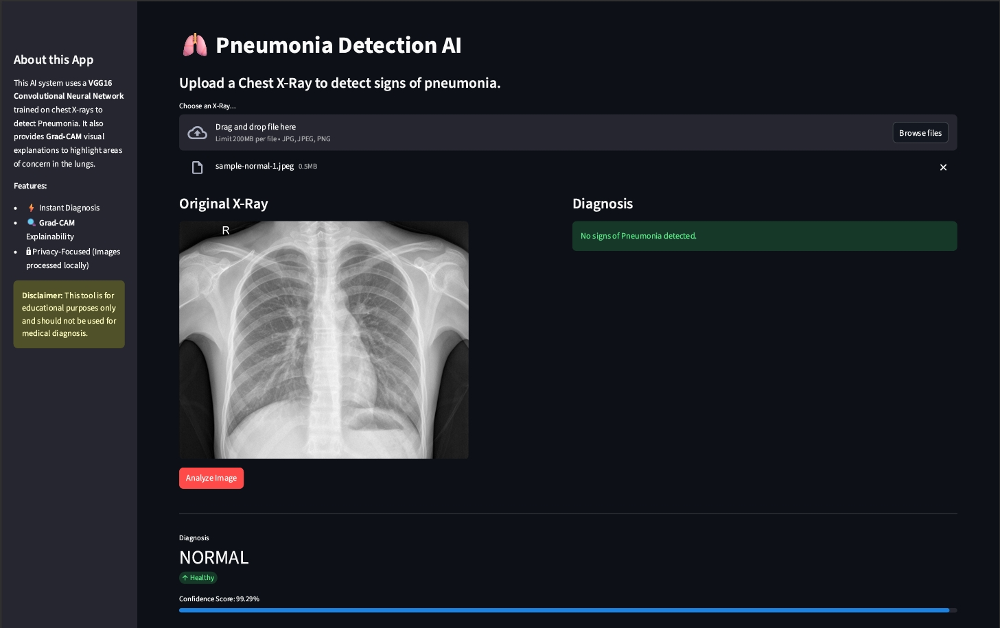
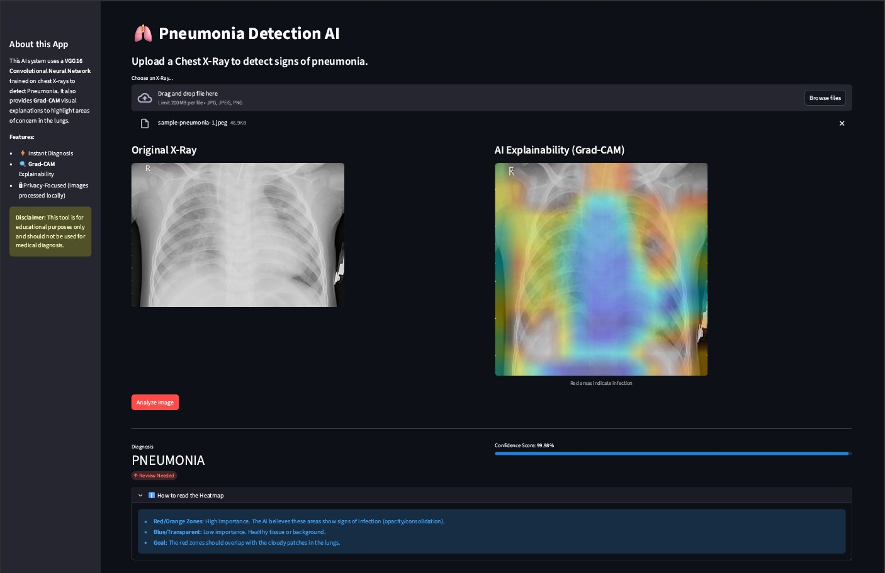
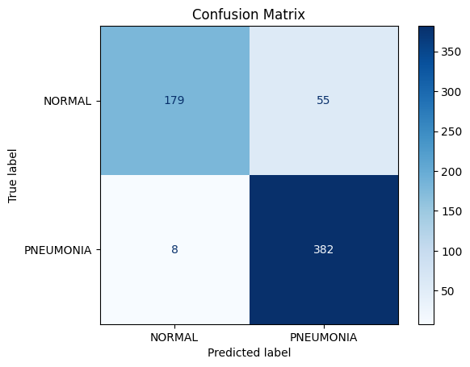
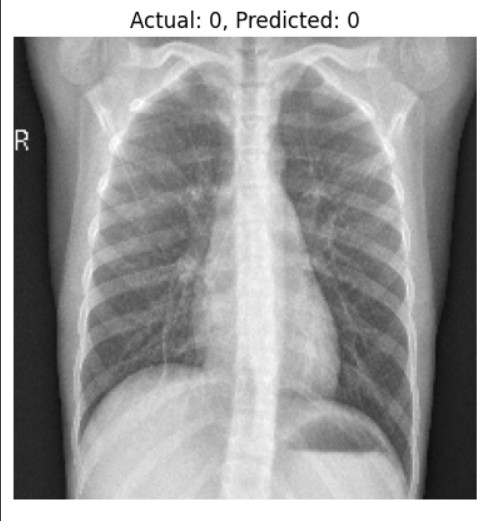
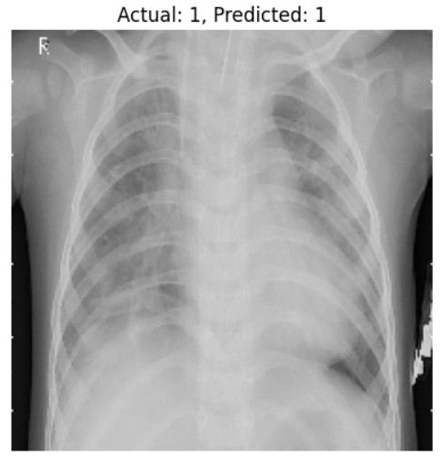
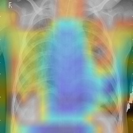

# Pneumonia Detection from Chest X-Rays

This personal project is a deep learning-based system for detecting pneumonia from chest X-ray images using a convolutional neural network (CNN) built on the VGG16 architecture. It includes a trained model, a prediction script, and sample images to test the model.

---

## Table of Contents

- [Project Overview](#project-overview)
- [Usage](#usage)
- [Model Details](#model-details)
- [Model Performance](#model-performance)
- [Explainability (Grad-CAM)](#explainability-grad-cam)
- [Folder Structure](#folder-structure)
- [Requirements](#requirements)

---

## Project Overview

Pneumonia is a serious lung infection that can be detected from chest X-ray images. This project uses **transfer learning** with a pre-trained VGG16 network to classify X-ray images into:

- **NORMAL**
- **PNEUMONIA**

The system preprocesses images, feeds them into the model, and outputs a predicted class with confidence.

---

## Web App Interface (Streamlit)

The project includes an interactive web application built with Streamlit. Features of the web app include:
- **File Upload:** Upload your own chest X-ray images (`.jpg`, `.jpeg`, `.png`) directly from your browser.
- **Side-by-side View:** Displays the original uploaded X-ray next to the AI's analysis.
- **Grad-CAM Visualization:** If pneumonia is detected, the app automatically generates and displays a heatmap over the X-ray, highlighting the regions the AI identified as indicative of infection (the "Hot Spot").
- **Confidence Metrics:** Provides a clear diagnosis (NORMAL or PNEUMONIA) along with the model's confidence score as a progress bar.
- **Privacy-focused:** All image processing is done locally on your machine.

### App Screenshots

**Initial State:**  
  
*What the app looks like when it first opens up.*

**Normal Scan:**  
  
*App scanning a normal chest X-ray, providing the diagnosis and confidence level.*

**Pneumonia Scan:**  
  
*App scanning a chest X-ray with pneumonia. It displays the Grad-CAM image along with the diagnosis, confidence level, and instructions on how to interpret the Grad-CAM.*

---

## Usage

1. **Install Dependencies**

   Ensure you have Python installed, then run:
   ```bash
   pip install -r requirements.txt
   ```

2. **Run the Streamlit Web App (Recommended)**

   Launch the interactive web interface from the project root folder:
   ```bash
   streamlit run src/app.py
   ```
   *This will open the app in your default web browser (usually at http://localhost:8501).*

3. **Run the Prediction Script (Command Line)**

   Run the script from the project root folder:
   ```bash
   python src/predict.py
   ```

4. **Test Custom Images (Command Line)**

   To test a different image, open src/predict.py and update the test-image_path variable at the bottom of the file:
   ```python
   test_image_path = os.path.join(BASE_DIR, "path", "to", "your-image.jpg")
   ```

---
## Model Details

Architecture:  
VGG16(Frozen Base) -> Global Average Pooling -> Dense (256, ReLU) -> Dropout (0.5) -> Output (Sigmoid)
Input Size: 224x224 RGB images  
Output: Binary classification (0 = NORMAL, 1 = PNEUMONIA)  

Files:  
pneumoniaDetectionModel.keras — Keras 3 native format (recommended)  
pneumoniaDetectionModel.h5 — legacy HDF5 format  
pneumoniaDetectionModel_SavedModel/ — TensorFlow SavedModel format  

---

## Model Performance

- **Test Accuracy:** 90%
- **Test Loss:** 0.31

### Confusion Matrix


### Classification Report

| Class       | Precision | Recall | F1-score | Support |
|-------------|-----------|--------|----------|---------|
| NORMAL      | 0.96      | 0.76   | 0.85     | 234     |
| PNEUMONIA   | 0.87      | 0.98   | 0.92     | 390     |
| **Accuracy**|           |        | 0.90     | 624     |
| Macro Avg   | 0.92      | 0.87   | 0.89     | 624     |
| Weighted Avg| 0.91      | 0.90   | 0.90     | 624     |


### Sample Predictions
  
_Normal X-ray predicted as NORMAL_  

  
_Pneumonia X-ray predicted as PNEUMONIA_  

---
## Explainability (Grad-CAM)

To ensure the model is trustworthy and medically relevant, we utilize **Grad-CAM (Gradient-weighted Class Activation Mapping)**. This technique generates a heatmap highlighting the specific regions of the X-ray that the AI focused on to make its diagnosis.

### How to Read the Heatmap
The heatmap uses the **Jet Colormap** to visualize the model's attention span, ranging from "High Importance" to "No Importance."

* **🟥 Red (The "Hot Spot")**
  * **Meaning:** **Critical Importance.** The model is 80-100% focused on these pixels.
  * **Interpretation:** In a positive diagnosis, this area represents the "smoking gun." The AI has detected features here (such as tissue consolidation, fluid, or opacity) that strongly indicate Pneumonia.
  * **Goal:** The red zone should overlap with the cloudy/white patches in the lungs visible to the human eye.

* **🟨 Yellow & 🟩 Green (Transitional Zones)**
  * **Meaning:** **Moderate Importance.** The model sees supporting evidence in these areas, but they are not the primary driver of the decision.
  * **Interpretation:** These colors typically form a "halo" around the red core. If the heatmap is *only* yellow/green without a strong red center, the model may be less confident in its prediction.

* **🟦 Blue / Transparent (Background)**
  * **Meaning:** **Low / No Importance.** The model has ignored these areas.
  * **Interpretation:** This includes healthy lung tissue, bones, the heart, and the background.
  * **Note:** Our system automatically filters out extremely low values (<20%) to keep the image clean, making these areas appear transparent or dark blue.

### Example Result
Below is a sample prediction where the model correctly identified pneumonia in the right lung (left side of the image) with 99.9% confidence. Notice how the Red zone strictly adheres to the infected tissue and ignores the clear lung on the other side.



---

## Folder Structure
pneumonia-detection/  
│  
├── models/  
│   ├── pneumoniaDetectionModel.keras  
│   ├── pneumoniaDetectionModel.h5  
│   └── pneumoniaDetectionModel_SavedModel/  
│  
├── src/  
│   ├── app.py  
│   ├── explainability.py  
│   └── predict.py  
│  
├── notebook/  
│   └── PneumoniaDetectionML.ipynb  
│  
├── sample_images/  
│   ├── confusion-matrix.png  
│   ├── sample-normal-1.jpeg  
│   ├── sample-normal-2.jpeg  
│   ├── sample-normal-prediction.jpg  
│   ├── sample-pneumonia-1_gradcam.jpeg  
│   ├── sample-pneumonia-1.jpeg  
│   ├── sample-pneumonia-2.jpeg  
│   └── sample-pneumonia-prediction.jpg  
│  
├── requirements.txt  
└── .gitignore  

---
## Requirements

Dependencies are listed in requirements.txt:  
tensorflow>=2.19.0  
numpy>=2.0.2  
Pillow>=11.3.0  
scikit-learn>=1.6.1  
matplotlib>=3.10.0  
pandas>=2.2.2  
streamlit>=1.41.0
